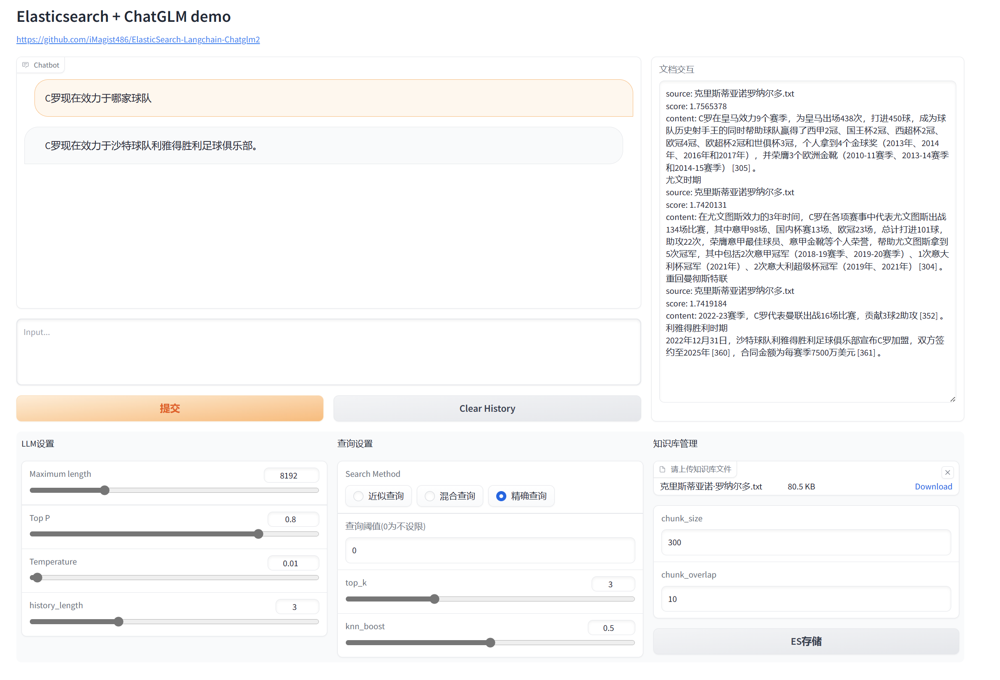

# 🔥ElasticSearch-Langchain-Chatglm2

# ✨项目介绍

受[langchain-ChatGLM](https://github.com/imClumsyPanda/langchain-ChatGLM)项目启发，由于Elasticsearch可实现文本和向量两种方式混合查询，且在业务场景中使用更广泛，因此本项目用Elasticsearch代替Faiss作为知识存储库，利用Langchain+Chatglm2实现基于自有知识库的智能问答。

本项目希望抛砖引玉，能够帮助大家快速地做技术验证和技术路线选取。

默认使用的embedding模型为[moka-ai/m3e-large](https://huggingface.co/moka-ai/m3e-large)

目前仅支持上传 txt、docx、md等文本格式文件。

默认使用余弦距离计算文本相似性。


# 🚀使用方式

### 修改配置文件 

修改配置文件[config.ini](https://github.com/iMagist486/ElasticSearch-Langchain-Chatglm2/blob/main/configs/config.ini)，配置Elasticsearch链接

模型可修改为本地路径

### 运行web demo

执行[web.py](https://github.com/iMagist486/ElasticSearch-Langchain-Chatglm2/blob/main/web.py) 

```python
python web.py
```

# 📑Demo详解



### 文档交互模块：

ES插入时文档交互模块会显示插入是否成功，或抛出异常内容；问答时，文档交互模块会展示查询到的内容，包括文档来源，文档内容和相似度分数。

### 查询设置模块：

**三种查询模式**，具体区别见Elasticsearch官方文档

近似查询：[Approximate kNN](https://www.elastic.co/guide/en/elasticsearch/reference/current/knn-search.html#approximate-knn)

混合查询：[Combine approximate kNN with other features](https://www.elastic.co/guide/en/elasticsearch/reference/current/knn-search.html#_combine_approximate_knn_with_other_features)

精确查询：[Exact, brute-force kNN](https://www.elastic.co/guide/en/elasticsearch/reference/current/knn-search.html#exact-knn) 

**查询阈值**：

仅返回相似度分数大于阈值的查询结果，0为不设限制

**top_k**：

返回最相关的k个文本

**knn_boost**：

适用于混合查询，knn_score所占比例


# 🐳Docker 部署

打包docker镜像

```sh
docker build -f docker/Dockerfile -t es-chatglm:v1.0 .
```

启动docker容器

```sh
docker run --gpus "device=0" -p 8000:8000 -it es-chatglm:v1.0 bash
```


# ❤️引用及感谢

1. [THUDM/chatglm2-6b](https://huggingface.co/THUDM/chatglm2-6b)
2. [moka-ai/m3e-large](https://huggingface.co/moka-ai/m3e-large)
3. [LangChain](https://github.com/hwchase17/langchain)
4. [langchain-ChatGLM](https://github.com/imClumsyPanda/langchain-ChatGLM)

# 📧联系方式

wzh486@outlook.com

欢迎沟通交流！
